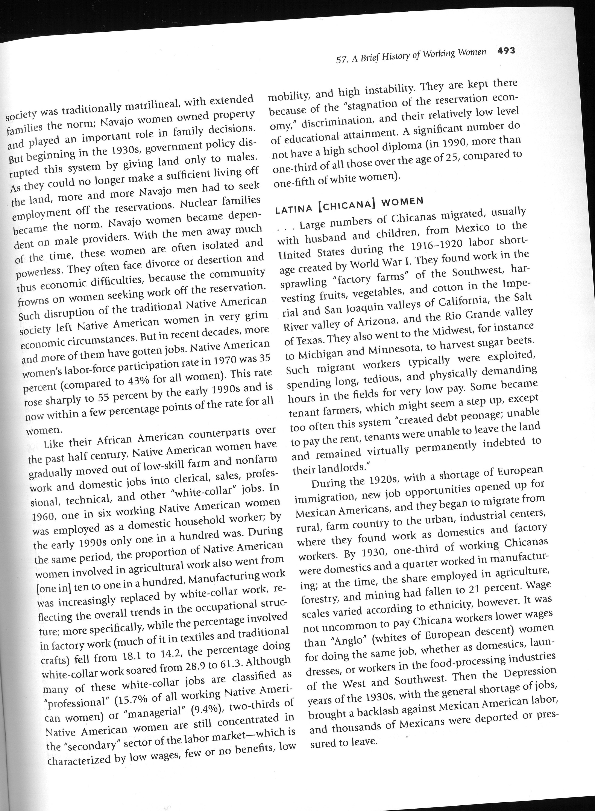
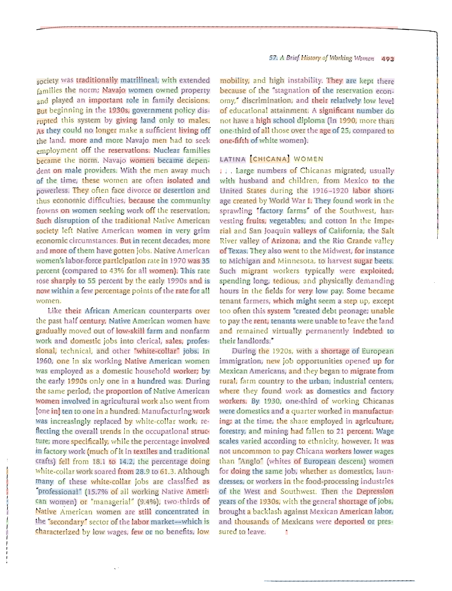
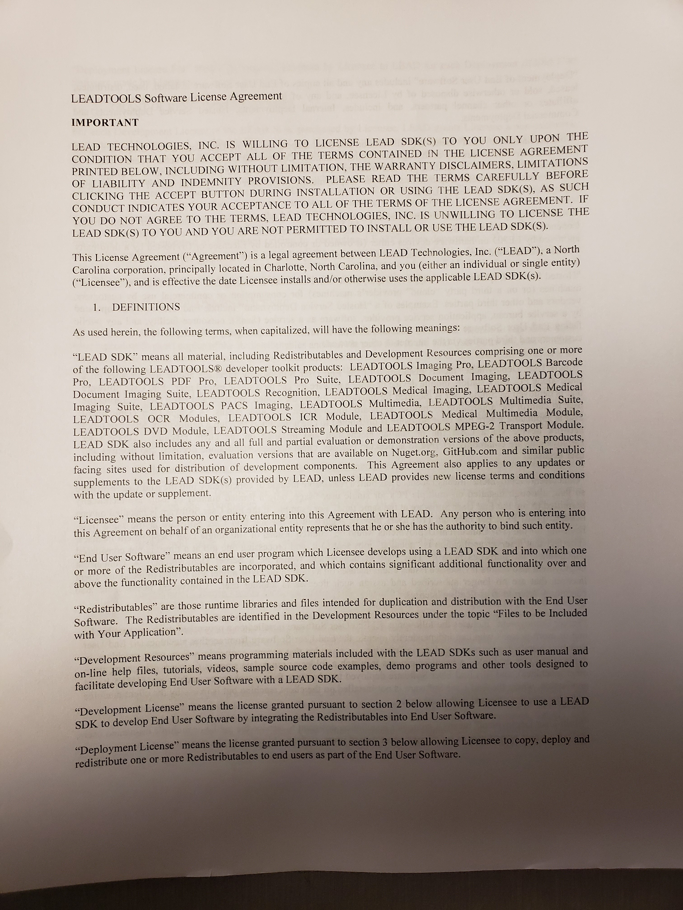
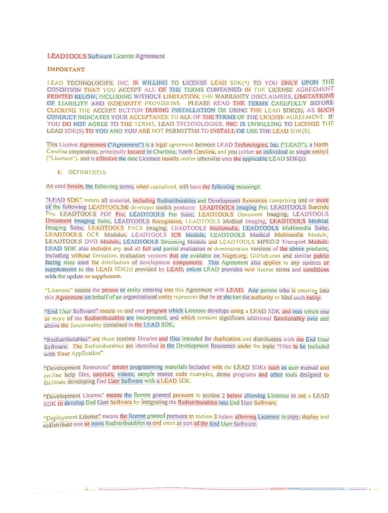
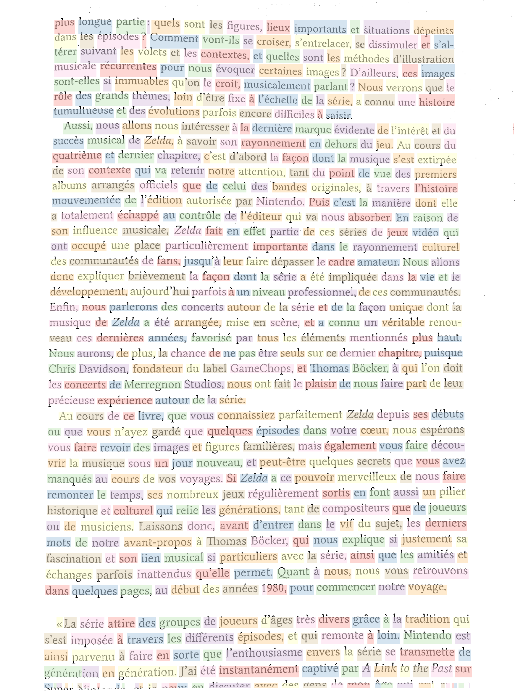

# Text-Segmentation

Projet de segmentation de texte dans des photographies de documents en utilisant des méthodes élementaires.
Sous la supervision de Saïd Ladjal dans le cadre du cours d'IMA201 de Télécom Paris.

## Démarche

Notre projet vise à implémenter et proposer des pistes d'amélioration à la méthode proposée dans l'article *Test Pre-processing and Text Segmentation for OCR* par Archan A. Shinde et D. G. Chougule, pour ségmenter les mots d'une photographie ou d'un scan d'une page de texte. La méthode se base sur la transformée de Fourier de l'image pour la redresser, puis sur la concentration sur les lignes et les colonnes des valeurs de pixels pour déterminer les points de section.

Afin d'améliorer les performance et la robustesse aux cas difficiles, nous avons proposés des étapes supplémentaires au préprocessing, notamment la binarisation de l'image en utilisant des seuils locaux (afin d'obtenir une meilleure robustesse aux ombres sur les photographies, et l'élimination de l'éventuel noir autour des scan pour réduire les fausse détections. Nous faisons également passer un filtre gaussien sur l'image binarisée afin d'obtenir une meilleure segmentation dans le cas des images de très bonne qualité (où la méthode de l'article segmente non pas les mots mais les lettres). Nous avons également essayés de reproduire la méthode sur une fenêtre mobile afin d'être plus robustes aux éventuelles déformations de la page (la méthode de l'article suppose des lignes rectilignes et parallèles).

## Exemples

Input           |  Segmentation  
:-------------------------:|:-------------------------:  
|   
|   
| 
